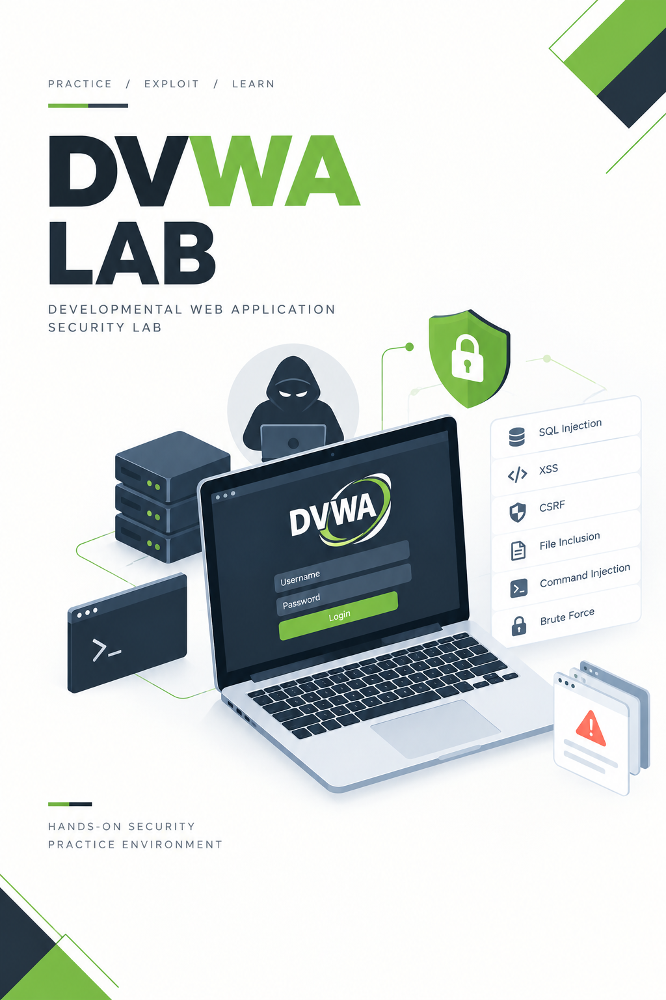

RUPESH K THAKUR

# Practical security work, documented clearly

Cybersecurity student focused on penetration testing, web application security, Linux and networks, and the engineering discipline behind trustworthy security work.

[Portfolio](https://rupeshkthakur.com.np/){ .md-button .md-button--primary }
[LinkedIn](https://www.linkedin.com/in/rupesh-thakur-aa98702a7/){ .md-button }
[TryHackMe](https://tryhackme.com/p/Cosmic777){ .md-button }
[Hack The Box](https://app.hackthebox.com/users/1936521){ .md-button }
[GitHub](https://github.com/IAZENT/security-engineering-portfolio){ .md-button }

Authorized lab environments · Evidence-led reporting · Building toward cloud security engineering

<!-- GENERATED_REPORTS_START -->

## Latest published report

REFLECTED XSS PENETRATION TEST · 2026-09-27

### Reflected XSS Penetration Test

A practical penetration-test walkthrough and sanitized report documenting scope, browser evidence, impact, remediation, and retest criteria.

OWASP A03:2021CWE-79PDF report

[Read the walkthrough/report](pentesting/reports/dvwa-reflected-xss-penetration-test.md){ .md-button .md-button--primary }
[Download PDF](pentesting/reports/DVWA-Reflected-XSS-Penetration-Test-Report.pdf){ .md-button }

## Top published reports

- **Reflected XSS Penetration Test** (2026-09-27) - A practical penetration-test walkthrough and sanitized report documenting scope, browser evidence, impact, remediation, and retest criteria.  
  OWASP A03:2021 · CWE-79 · PDF report · [Read report](pentesting/reports/dvwa-reflected-xss-penetration-test.md) · [PDF](pentesting/reports/DVWA-Reflected-XSS-Penetration-Test-Report.pdf)

<!-- GENERATED_REPORTS_END -->

## Portfolio

<strong>Penetration testing</strong>Reports, findings, evidence handling, remediation, and retesting.<a href="pentesting/">View section →</a>

<strong>Walkthroughs</strong>Practical lab work from setup and testing through interpretation and cleanup.<a href="walkthroughs/">View section →</a>

<strong>Research</strong>Technical notes that separate verified facts, interpretation, sources, and open questions.<a href="research/">View section →</a>

<strong>Projects</strong>Security tooling, home labs, automation, and secure infrastructure work.<a href="projects/">View section →</a>

## Publication standard

Every entry states what was authorized, what was tested, what was observed, why it matters, and how it can be fixed. Credentials, tokens, client information, internal hostnames, and unredacted logs remain outside the public repository.
