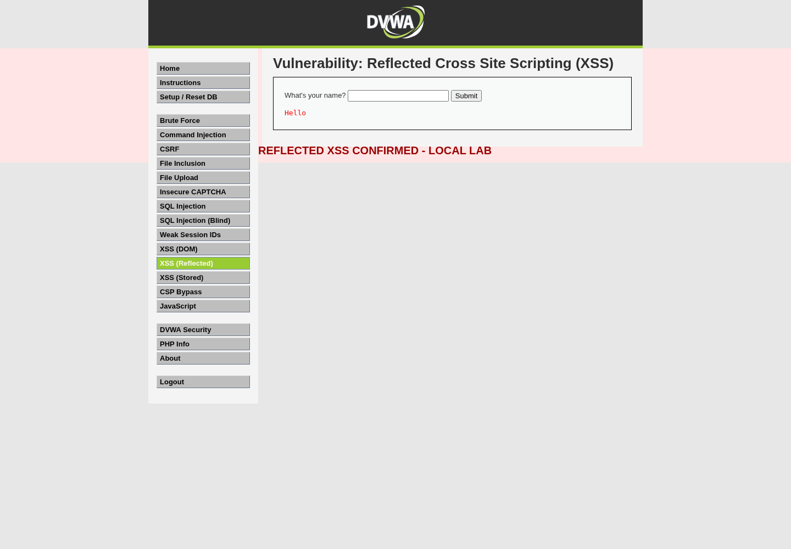

# Web Application Security Assessment: Reflected XSS Case Study

**Document type:** Sanitized portfolio case study  
**Assessment date:** 27 September 2026  
**Target:** DVWA intentionally vulnerable lab application  
**Assessment status:** One verified test case documented  
**Finding:** Reflected Cross-Site Scripting (CWE-79)

**PDF:** [Download the PDF report](DVWA-Reflected-XSS-Case-Study.pdf)

> This case study covers the reflected-XSS module only. It does not claim that the complete DVWA application or every module has been assessed.

## Executive Summary

The reflected-XSS module was assessed using a controlled, non-destructive web application security testing workflow aligned with the OWASP Web Security Testing Guide. User-controlled input in the `name` parameter was reflected into the HTML response without context-aware output encoding. A harmless browser-side proof confirmed JavaScript execution in the application origin.

The issue is assessed as **Medium severity in this lab context**. In a real application, exploitability and impact would depend on authentication, affected functionality, data exposure, cookie protections, and the privileges of a victim who opens a crafted link.

## Scope and Authorization

Testing was performed against an intentionally vulnerable application in a controlled local lab owned and operated for security-learning purposes. The activity was limited to the reflected-XSS functionality and used non-destructive proof techniques.

The following activities were excluded:

- Testing of public or third-party systems
- Denial-of-service or destructive actions
- Credential theft, persistence, or data exfiltration
- External callbacks or transmission of lab data

## Methodology

The assessment followed this sequence:

1. Confirm the authorized lab scope and establish an application baseline.
2. Identify the input surface and observe how submitted data is reflected.
3. Use a benign proof marker to validate client-side execution.
4. Record the affected parameter, behavior, impact, and remediation.
5. Retain detailed working evidence separately and publish only this sanitized case study.

The reporting structure is informed by the [OWASP Web Security Testing Guide](https://owasp.org/www-project-web-security-testing-guide/), [NIST SP 800-115](https://csrc.nist.gov/pubs/sp/800/115/final), and the [OWASP Cross-Site Scripting Prevention Cheat Sheet](https://cheatsheetseries.owasp.org/cheatsheets/Cross_Site_Scripting_Prevention_Cheat_Sheet.html).

## Finding Summary

### Table 1. Finding summary

| ID | Finding | Severity | Status |
| --- | --- | --- | --- |
| F-001 | Reflected Cross-Site Scripting in the `name` parameter | Medium | Verified; remediation recommended |

## F-001: Reflected Cross-Site Scripting

### Description

The `name` parameter is reflected into the server-generated HTML response without context-aware output encoding. A benign script marker was interpreted by the browser, demonstrating reflected cross-site scripting.

**Classification:** CWE-79, Improper Neutralization of Input During Web Page Generation  
**OWASP mapping:** A03:2021 - Injection  
**Affected component:** Reflected-XSS input and response handling

### Reproduction Summary

Submit a harmless script marker through the reflected-XSS input field and observe whether the returned page treats the marker as executable HTML or JavaScript. This case study omits the exact payload and internal request details; the working evidence contains the reproducible test record.

### Evidence

The browser capture below shows the affected functionality and the local proof marker. No credentials, session tokens, external callback data, or confidential infrastructure details are included.

*Figure 1. Sanitized browser evidence for the reflected-XSS case study.*

### Impact

If the same behavior existed in a real authenticated application, an attacker could craft a link that executes script in the victim's application origin. Depending on the application's functionality and browser protections, consequences could include phishing, page manipulation, unauthorized actions performed in the victim's session, or access to data available to client-side code.

### Root Cause

Untrusted input is inserted into an HTML response without encoding it for the exact output context. Client-side filtering and blacklist-based blocking should not be treated as substitutes for correct server-side output handling.

### Remediation

- Apply context-aware output encoding at the point where untrusted data is written into HTML, attributes, JavaScript, CSS, or URLs.
- Prefer safe DOM APIs and safe sinks when rendering data in client-side code.
- Validate business-format input where appropriate, while treating validation as an additional control rather than the primary XSS defense.
- Add regression tests for reflected, stored, and DOM-based XSS behavior.
- Review Content Security Policy and cookie attributes as defense in depth.

### Retest Criteria

The original proof should be inert after remediation. Representative output contexts should be tested, before-and-after evidence should be captured, and the final status should be recorded with the remediation date and test result.

## Limitations

This is a case study from an intentionally vulnerable lab application. It demonstrates assessment and reporting technique; it is not a production penetration-test opinion. The result must not be generalized to another application without validating its code, authentication model, business impact, exposure, and compensating controls.

Only the reflected-XSS module is included in this publication. Other application modules are outside this case study and have not been represented as assessed.

## References

- [OWASP Web Security Testing Guide](https://owasp.org/www-project-web-security-testing-guide/)
- [OWASP Cross-Site Scripting Prevention Cheat Sheet](https://cheatsheetseries.owasp.org/cheatsheets/Cross_Site_Scripting_Prevention_Cheat_Sheet.html)
- [NIST SP 800-115: Technical Guide to Information Security Testing and Assessment](https://csrc.nist.gov/pubs/sp/800/115/final)
- [CWE-79: Improper Neutralization of Input During Web Page Generation](https://cwe.mitre.org/data/definitions/79.html)
